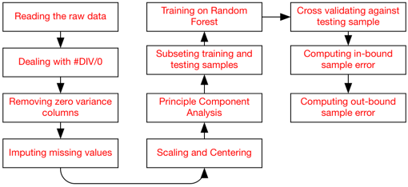

Practical Machine Learning Coursera Project
========================================================

Author: Omar Kamal

## Introduction:
Using devices such as Jawbone Up, Nike FuelBand, and Fitbit it is now possible to collect a large amount of data about personal activity relatively inexpensively. 
These type of devices are part of the quantified self movement - a group of enthusiasts who take measurements about themselves regularly to improve their health, to find patterns in their behavior.
The goal will be to use data from accelerometers on the belt, forearm, arm, and dumbell of 6 participants. They were asked to perform barbell lifts correctly and incorrectly in 5 different ways.

## Steps:
### Reading, cleaning and prepocessing the data.


We start by loading the data from the training set.

```{r, echo=FALSE, cache=TRUE, results='hide'}

rm(list=ls())
setwd("C:/Coursera/Practical Machine Learning/Project")
require(caret)

```

```{r}
raw_training_data <- read.csv("./pml-training.csv",header=T)
```

Converting the data field from character into a Date field.

```{r,}
raw_training_data$cvtd_timestamp_mod <- as.Date(as.character(raw_training_data$cvtd_timestamp),format="%d/%m/%Y %H:%M")

```

Dealing with ** DIV/0 ** feilds:
* Some columns have cells containg **DIV/0** cells, so a good strategy to replace those with **NaN**.
* Then looping over those columns that have such cells - and cast their type to numeric.

```{r, }
#getting columns that have DIV/0
columns_with_div_zero = names(which(sapply(apply(raw_training_data,2,function(x) grep("DIV/0",x)),function(x) length(x))>0))

training_data <- raw_training_data
for(i in columns_with_div_zero) {
  index_nan <- which(training_data[,i]=="#DIV/0!") 
  training_data[index_nan,i]=NaN
  training_data[,i] <-as.numeric(training_data[,i]) 
}

```

Then we need to drop un-nessary levels from the data frame.

```{r, }
training_data <- droplevels(training_data)

```

Separting **factor** variables together and **numeric** variables together.

```{r, cache=TRUE, }
factor_columns <- training_data[,c(1,2,3,4,5,6,160,161)]
numeric_columns <- training_data[,-c(1,2,3,4,5,6,160,161)]
```

### Selecting features

We start by getting rid of features that have zero variance by getting their indexs.

```{r, warning=FALSE, }
require(caret)
nsv <- nearZeroVar(numeric_columns,saveMetrics=TRUE)
columns_to_delete <- which(nsv$zeroVar==T)

```

Those are the columns that have zero variance.

```{r, }
colnames(numeric_columns)[columns_to_delete]

```

Then we create a new data frame with only the columns that have a **non zero variance**.

```{r, }
numeric_columns_with_non_zero_variance <- numeric_columns[,-columns_to_delete] 

```

### Imputing missing data
As a strategy for getting good accuracy, we can use **knnImpute** method to fill-in missing or NaN value with appropriate values based on the K neighbours cases.


```{r, }
impute_object <- preProcess(x=numeric_columns_with_non_zero_variance,method="knnImpute")
numeric_columns_imputed <- predict(impute_object,numeric_columns_with_non_zero_variance)
```

Similarly we elemintae columns that have zero variance after imputing the data.frame

```{r, }
require(caret)
nsv2 <- nearZeroVar(numeric_columns_imputed,saveMetrics=TRUE)
columns_to_delete2 <- which(nsv2$zeroVar==T)

```

Those are the columns to eleminate

```{r, }
colnames(numeric_columns_imputed)[columns_to_delete2] 
```

### Reducing the features using Principle Component Analysis

A good idea to reduce the number of features is to carry out Principle Component Analysis for the imputed data frame. Doing so, we reduce the number of features. We use a **threshold** of **90%** to determine the number of principle components.
> Note: we also did scale and center the data.

```{r, }
numeric_columns_imputed_non_zero_variance <- numeric_columns_imputed[,-columns_to_delete2]
  
pca_obj <- preProcess(numeric_columns_imputed_non_zero_variance,method=c("scale","center","pca"),thresh=0.9)
numeric_pca_final <- predict(pca_obj,numeric_columns_imputed_non_zero_variance)

#heatmap(as.matrix(numeric_pca_final))
```

Combining the factors columns with the transformed PCA data frame will compose the new training data frame.

```{r, }
new_training_data <- cbind(factor_columns[,c(2,6,7,8)],numeric_pca_final)

```

### Subseting the training sample
We will use the **createDataPartition** command in the **caret** package to divide our data frame into:
* A training sample (**75%**) of the data frame.
* A testing sample (**25%**) of the data frame.

The model will be trained on the the training subset and cross-validated on the testing sample.

```{r, }
inTrain <- createDataPartition(y=new_training_data$classe,p=0.75,list=FALSE)

training <- new_training_data[inTrain,]
testing <- new_training_data[-inTrain,]
```

### Building the model
We will build our model using **Random Forest** technique.

```{r, eval=FALSE}
### Fitting the data
rf_model1 <- train(classe ~ ., data=training[,-c(1,4)],method="rf")

```

* See the model

```{r, echo=FALSE}
load("./rf_model2.R")
rf_model1

```

#### In bound sample accuracy

Checking the accuracy of the **random forest** model.

* Predict the same training data using the model.
* Compute the **confusion matrix** to get the accuracy of the model (_**inbound sample error**_).

```{r, warning=FALSE, }
p_inbound <- predict(rf_model1,newdata=training[,-3])
confusionMatrix(p_inbound,training[,3])

```

* You can see it is **98.6 %** 

#### Out bound sample accuracy (Cross Validation)

Checking against the testing subset (**Cross Validation**):

* Again predict the test subset using the model.
* Compute the **confusion matrix** for the testing subset.

```{r,warning=FALSE, }

p1 <- predict(rf_model1,newdata=testing[,-3])
confusionMatrix(p1,testing[,3])


```

* You can see it is **98.4%** 

#### You can see that the accuracy for the testing subset (**cross Validation**) returna very good accuracy **98.4%**.

-----

## Problem Sets
Now, we need to load the 20 cases that we need to predict and do the same exact process for the data including **cleaning** the data, **removing columns** that we did remove in the training set, dealing with DIV/0 in case found, **imputing missing data**, **scaling** and doing **PCA** the same way did in the training data.
> Note: detailed explaination for each step is ignored in this section as it almost identical to the section above.


```{r, }

# Reading the data for the problems
raw_testing_data <- read.csv("./pml-testing.csv",header=T)

# Converting date field from character to Date
raw_testing_data$cvtd_timestamp_mod <- as.Date(as.character(raw_testing_data$cvtd_timestamp),format="%d/%m/%Y %H:%M")


# Converting the same columns we removed in the training from characters to numeric.
# Converting 
testing_data <- raw_testing_data
for(i in columns_with_div_zero) {
  testing_data[,i] <-as.numeric(testing_data[,i]) 
}

# Drop extra levels for factor columns 
testing_data <- droplevels(testing_data)

# Separating between factor columns and numeric columns that will scale, center and carry out PCA against.
testing_factor_columns <- testing_data[,c(1,2,3,4,5,6,160,161)]
testing_numeric_columns <- testing_data[,-c(1,2,3,4,5,6,160,161)]

# Deleting the same exact columns we did in the training set to get rid of columns that we don't consider as useful feature in prediction.
testing_numeric_columns_2 <- testing_numeric_columns[,-columns_to_delete] 

# Impute missing data with the same object we did compute in the training round.
testing_numeric_columns_3 <- predict(impute_object,testing_numeric_columns_2)


# deleting the same columns that we previously deleted in the training round (due to the zero variation)
testing_numeric_columns_4 <- testing_numeric_columns_3[,-columns_to_delete2]

# Now transform the data frame (scale, center and PCA) using the same PCA object we developed in the training round.
testing_numeric_columns_5 <- predict(pca_obj,testing_numeric_columns_4)

# Merge the transformed data columns with the original factor columns.
new_testing_data <- cbind(testing_factor_columns[,c(2,6,7,8)],testing_numeric_columns_5)
```

### Predict the results for the problem set
Using the same Random Forest model we developed in the training round, we predict the outcome for the problem set.

```{r, }
p_tested <- predict(rf_model1,newdata=new_testing_data[,-3])

## Combine the results with the problem id in a single data frame.
results <- cbind(problem_id=new_testing_data[,3],prediction=as.character(p_tested))
```


